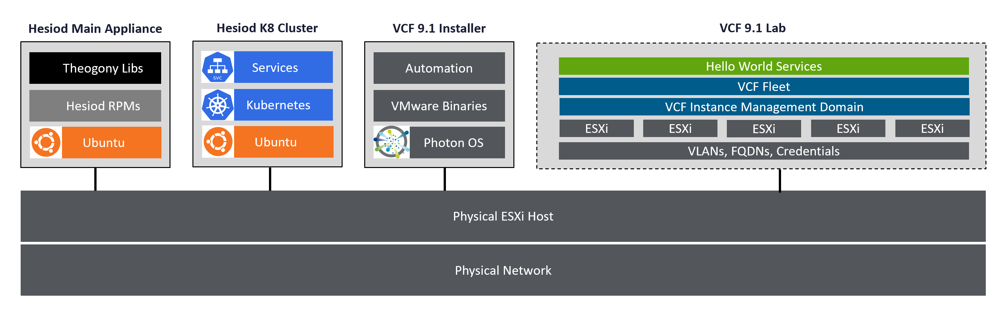

# Hesiod Theogony
   
This is a branch from Project Hesiod: https://github.com/boconnor2017/hesiod. **Theogony** is an ancient Greek poem by Hesiod that details the origins of the gods, the creation of the universe, and serves as a foundational text for Greek Mythology. As such the contents of this repository represent the foundational codebase for a VMware based home lab. 

# Prerequisites
* At least one physical server running ESXi 9
* A router (virtual or physical) where you can create subnets
* Appropriate access and entitlements to Broadcom software
* Ubuntu 64-bit Server ISO
* ESXi 9.1 ISO
* SDDC Manager (VCF Installer) 9.1 OVA

# Resource Requirements
| Component                | vCPU | vMemory (GB) | vStorage (GB) |
|--------------------------|------|--------------|---------------|
| Hesiod Main Appliance    | 4    | 16           | 100           |
| Hesiod K8 Cluster Master | 4    | 16           | 100           |
| Hesiod K8 Cluster Node 1 | 4    | 16           | 100           |
| VCF Installer            | 4    | 16           | 914           |
| Nested ESXi Host 1       | 40   | 320          | 1080          |
| Nested ESXi Host 2       | 40   | 320          | 1080          |
| Nested ESXi Host 3       | 40   | 320          | 1080          |
| Nested ESXi Host 4       | 40   | 320          | 1080          |
| Nested ESXi Host 5       | 40   | 320          | 1080          |
| TOTAL:                   | 40   | 1664         | 6614          |

# Architecture Summary


# Quick Start: Deploy Hesiod Main Appliance
Step 1: Deploy Ubuntu 64-bit Server with OpenSSH enabled. Login to the OS with SSH using defined username and password.   

Step 2: Download the `prep-ubuntu` bash script. 
```
sudo curl https://raw.githubusercontent.com/boconnor2017/hesiod-theogony/refs/heads/main/ubuntu/prep-ubuntu.sh >> prep-ubuntu.sh
```

Step 3: Run the `prep-ubuntu` bash script.
```
sudo sh prep-ubuntu.sh
```

Step 4: Navigate to `/usr/local/hesiod-theogony` working directory.
```
cd /usr/local/hesiod-theogony
```

Step 5: Run `hesiod-theogony` python script using the `--help` parameter.
```
python3 hesiod-theogony.py --help
```   

From this point forward, running the `hesiod-theogony` python script on this prepped Ubuntu Server will be referred to as using the **Hesiod Main Appliance**.

# Modules: Deploy a VMware Lab Environment
Using the **Hesiod Main Appliance**, select from the list of modules below and pass parameters accordingly.

## Module 1: Create Lab Spec JSON file
The `lab_spec.json` file contains the specs for your home lab. Specs include physical network configurations, physical host configurations, storage configurations, credentials, etc. Blank json templates are stored in the `/json_lib` folder. This script will generate a copy and will prompt you for inputs. Configurations are stored in the `/conf` folder. If you prefer to generate your own json file, copy `/json_lib/lab_spec.json`, paste into `/conf/lab_spec.json` and edit directly using vi editor. Alternatively, if you've created one already, simply upload it to `/conf/lab_spec.json`. **WARNING: Do not edit or remove any of the files in /json_lib. Copy only.**
```
python3 hesiod-theogony.py -m1
```  

## Module 2: Deploy Hesiod K8 Cluster
The Hesiod K8 Cluster is used for external services needed to run your nested VCF environment. External services include: DNS, offline depots, etc. The Hesiod Main Appliance will interact with your physical ESXi host(s) using details from **Module 1** to build virtual machines running Ubuntu Servers with Kubernetes. 
```
python3 hesiod-theogony.py -m2
```  

## Module 3: Deploy Technitium DNS Server
A DNS server is required for your VMware environment. If you don't have one already, deploy a DNS server container hosted on **Module 2** K8 cluster.
```
python3 hesiod-theogony.py -m3
```  

## Module 4: Create VCF Spec JSON file
The `vcf9.1_spec.json` file contains the specs for the nested instance of VCF that you are deploying to your home lab. For details on the VCF 9.1 components that will be deployed, please see the [VCF 9.1 Release Notes](https://techdocs.broadcom.com/us/en/vmware-cis/vcf/vcf-9-0-and-later/9-1/deployment/deploying-a-new-vmware-cloud-foundation-or-vmware-vsphere-foundation-private-cloud-.html). **NOTE: this module only supports simple deployment. If there are use cases for HA or production, use the automation in this repo as a baseline and edit accordingly in a new branch.**
```
python3 hesiod-theogony.py -m4
```  

## Module 5: Deploy VCF 9.1 Ready Nested ESXi Hosts
These hosts will become the VCF 9.1 management cluster. The automation in this script deploys the ESXi hosts from ISO and configures them appropriately so that they are ready to be consumed via the VCF installer. 
```
python3 hesiod-theogony.py -m5
```  